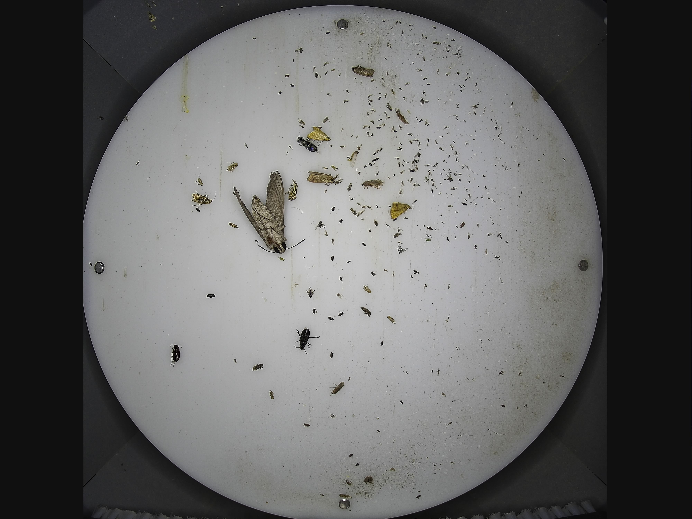

## 新手入yolov8+python+opencv虫情检测系统

### 改善的空间还很大，训练的数据集太少，大佬有时间可以改进一下，让准确率更高
- 原图

- 效果图


```angular2html
.
├── Arial Unicode.ttf //字体文件
├── README.md
├── YoloRecognition.py //主要py文件
├── __pycache__
│   └── YoloRecognition.cpython-39.pyc
├── best.pt //yolov8训练集
├── insect-yolov8-2024.7 //数据集
│   ├── README.dataset.txt
│   ├── README.roboflow.txt
│   ├── data.yaml
│   ├── train
│   └── valid
├── pic //识别效果图
│   ├── 1.jpg
│   ├── 1.png
│   ├── 10.jpg
│   ├── 10.png
│   ├── 2.jpg
│   ├── 3.jpg
│   ├── 3.png
│   ├── initial
│   ├── predict.png
│   └── predict1.png
├── requirements.txt
├── runs //yolov8训练pt文件数据
│   └── detect
```
